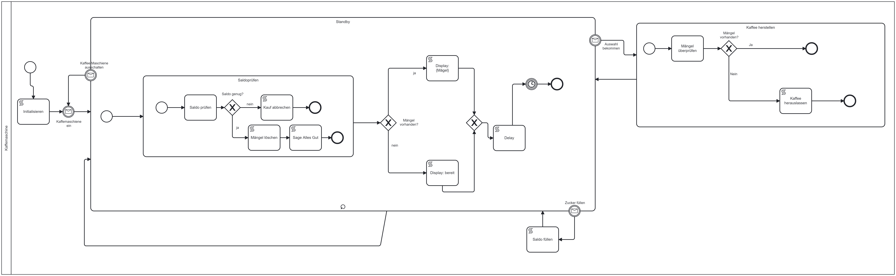

# Kaffeemaschine
Für das Modul M254 wurde eine Kaffeemaschine in BPMN umgesetzt.

Team: Samuel Hajnik, Oliver Achermann und Raphael Blaauw

## Architektur

## Use Cases

[Use Cases im Teams](https://tbzedu.sharepoint.com/:w:/r/sites/IT_AP20b_M254/Kursmaterialien/99%20Abgabe%20Lernenden/06%20Abgabe%20Modulprojekt/01%20Projektbeschrieb%20(Use%20Cases)/Achermann,%20Blaauw,%20Hajnik/Use%20case.docx?d=w04eb5b622d4b42ce95af199f76d4c7f3&csf=1&web=1&e=hFrkYc)

## BPMN Diagramm

## Test Cases
| Test Case ID |Name| Beschreibung                        | Input          | Expected Output       | Actual Output | Status |
|--------------|---|------------------------------------|----------------|-----------------|---------------|--------|
| TC_001       | Kaffee-Produkt auswählen            | Überprüfen Sie, ob der Kunde erfolgreich ein Kaffee-Produkt auswählen kann.  | Der Kunde interagiert mit der Auswahl-Schnittstelle und wählt ein Kaffee-Produkt aus.| Das ausgewählte Kaffee-Produkt wird vom System registriert. |Kaffee-Produkt kann ausgewählt werden | passed
| TC_002       | Menge auswählen            | Überprüfen Sie, ob der Kunde nach der Auswahl eines Kaffee-Produkts die Menge festlegen kann.   | Der Kunde wählt ein Kaffee-Produkt aus und gibt die Menge an.| Die ausgewählte Menge wird vom System registriert.              |Menge kann ausgewählt werden        |passed         |
| TC_003       | Kaffeeherstellung mit ausreichendem Geld           | Überprüfen Sie, ob bei ausreichendem Geldbetrag der Kaffeeherstellungsprozess erfolgreich abgeschlossen wird.   |: Der Kunde hat ausreichend Geld für das ausgewählte Kaffee-Produkt. |Der Kaffeeherstellungsprozess wird erfolgreich abgeschlossen, und der Kunde erhält das gewünschte Getränk.               |Kaffe wird hergestellt und Geld abgezogen        | passed        |
| TC_004       | Kaffeeherstellung mit unzureichendem Geld           | Überprüfen Sie, ob bei unzureichendem Geldbetrag der Kaffeeherstellungsprozess abgebrochen wird.   | Der Kunde hat nicht genügend Geld für das ausgewählte Kaffee-Produkt. | Der Kaffeeherstellungsprozess wird abgebrochen, und es wird dem Kunden mitgeteilt, dass nicht genügend Geld vorhanden ist.              |Infotext wird angezeigt        | passed        |

## Bei Cors Probleme

### Windows

1. `Windows + R` 
2. In the Run dialog box, paste the following command:
`chrome.exe --user-data-dir="C://Chrome dev session" --disable-web-security`

## Reflexion

Unser Camunda Modulprojekt war spannend jedoch musstenw wir einige Herausforderungen meistern, dafür konnten wir wertvolle Erkenntnisse gewinnen.
Die grösste Herausforderung unseres Projekts bestand darin, die nahtlose Integration zwischen dem Frontend und dem Camunda Cockpit sicherzustellen. Dies erforderte sorgfältige Abstimmung zwischen den beiden Lagern.

Ein Schlüssel zum Erfolg war unser Einsatz von Kanban-Methoden und ein hervorragendes Teamwork. Wir haben unsere Arbeit in übersichtliche Aufgaben unterteilt.

Wenn wir das Projekt rückblickend betrachten, würden wir in Zukunft mehr Zeit in das Prototyping investieren. Dies hätte uns geholfen, potenzielle Probleme frühzeitig zu erkennen und Lösungen zu entwickeln.